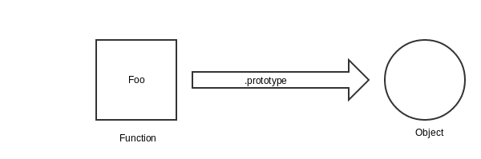
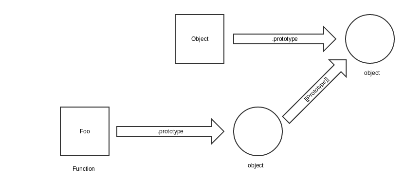
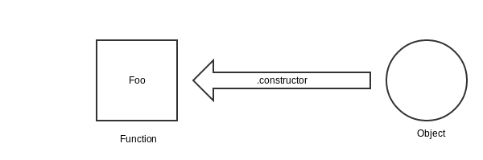
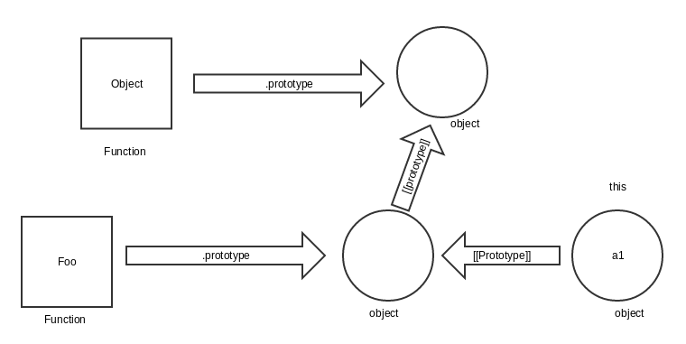

##Difference between _prototype_ and _proto_

####For those who are impatient
>'_prototype_' is just a random name given to the _linkage_
>between a function and an _unnamed_ object that gets
>created at the time of function creation.

while
>'_proto_' is the **getter** function for fetching the internal linkage
>between the object referenced by the **this** keyword and the _prototype_
>of the function.

**Confused?**

Let me explain these terms with the help of an example.  
Consider the below code:  
```javascript
  function Foo(who) {
    this.me = who;
  }
  Foo.prototype.identify = function() {
    return "I am " + this.me;
  };

  var a1 = new Foo("a1");
  var a2 = new Foo("a2");

  a2.speak = function() {
    alert("Hello, " + this.identify() + ".");
  };
  a1.constructor === Foo;
  a1.constructor === a2.constructor;
  a1.__proto__ === Foo.prototype;
  a1.__proto__ === a2.__proto__;
```
Before anything gets executed in the above code
we already have somethings, which are:  
* A function called 'Object' (capital 'O').
* An object which does not have any name, but a label
   named '.prototype'.  
   

The "Object" function has been linked to the object which does not  
have any name. On the unnamed object, we have functions  
like "toString" and several values which are built in the language.

When the first line of above code gets executed following things happen:  
* We will have a function called "Foo".
* It's also going to create an "object" that we are linked to, and it will
   have an arbitrary linkage named: "_.prototype_".
     

>    Foo func -------".prototype"-------> unnamed object

* Also the _unnamed object_ gets linked to the
   unnamed object of the 'Object' function and this
   linkage is labeled as '__[[Prototype]]__'.
   
* In addition to the above connection, there is
   also a connection in the opposite direction.
   The _unnamed_ object has a property on the "function"
   called "_.constructor_".
    

>    Foo function <------".constructor"---- unnamed object

Most people think the '_.constructor_' means is
constructed by. In other words the unnamed object 
is constructed by the "function".
"But its not true".

The word '_constructor_' is an __arbitrary__ word
it could have been any other __random word__.

So there is a "two-way" linkage.  

Now, when the code "**var a1 = new Foo('a1')**" gets executed
we will have following things:  
* A brand new object will gets created.
* The object gets linked to another object.
   (so the newly created object will get linked to the "unnamed object.")
* The contex gets set to the '**this**'. So the newly
   created object will have a property called 'me',
   which will have the value 'a1'.
* We return '**this**', which gets assigned to the variable 'a1' in 
   the code. So now the name of the newly created object will 
   be 'a1'.  
   

So when we execute '**a1.\_\_proto\_\_ === Foo.prototype**' 
it will check whether 'a1' have a '\_\_proto\_\_' property.
As it does not have, it will go up in the _Prototypical_
chain and check the same thing on the _unnamed_ object.
As that object also does not have the '\_\_proto\_\_'
property, so we will go _up_ in the _Prototypical_ chain,
which happens to be the _unnamed object_ of the 
'__Object__' function.

Now on this object there is a property named '\_\_proto\_\_'.  
It turns out that it is _not a property_, rather its
a '__getter__' function. So the above code is a 
"_function call_".

This function returns the '_internal prototype_' linkage
of whatever the '**this**' binding is.

So when we have called the '\_\_proto\_\_' function, the 
'**this**' keyword is referencing 'a1'.
So this function "returns the internal prototype" linkage
of 'a1'.
So the "[[Prototype]]" was the _internal linkage_ and '\_\_proto\_\_'
is the _public linkage_ of 'a1' with the unnamed object
of the 'Foo' function.

So '\_\_proto\_\_' is the public property that references
the internal characteristics.

So we can see that 'a1.\_\_proto\_\_' is same as 
'Foo.prototype'.
The same goes for 'a2'.
